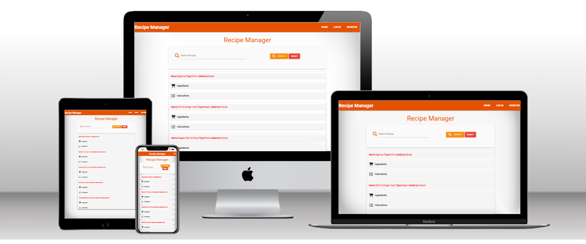
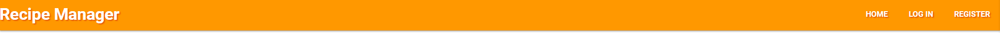
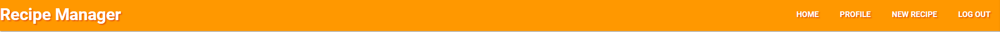
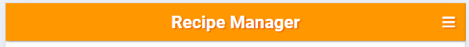
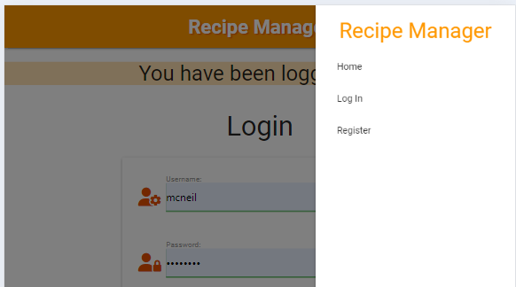
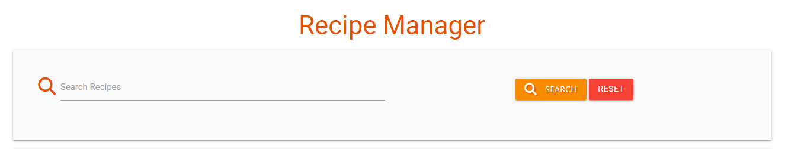
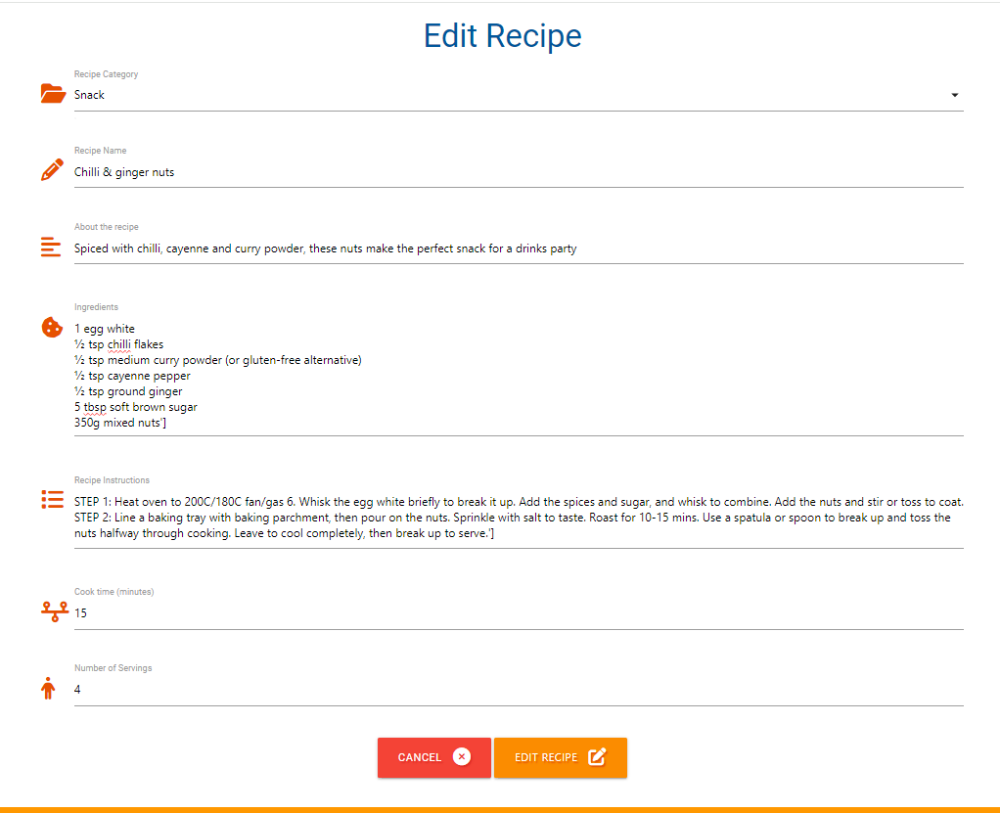
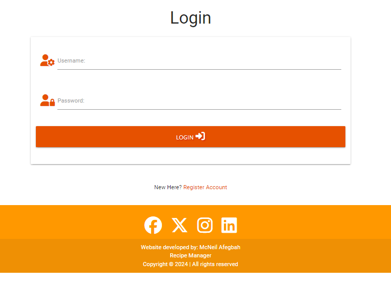
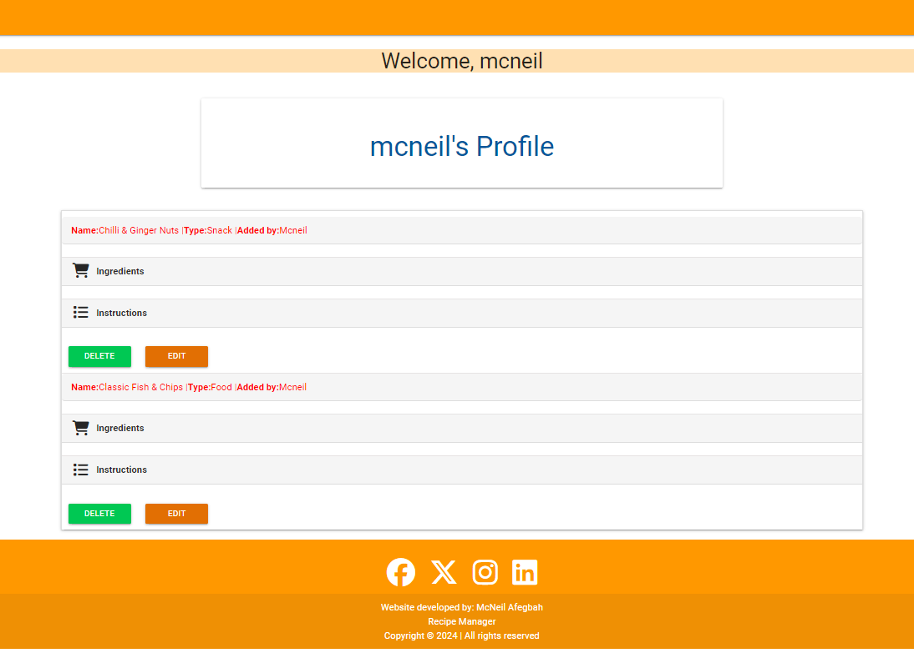
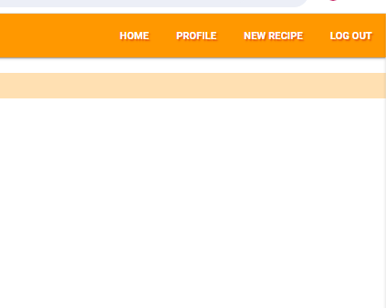

# Recipe Manager,

## Introduction

The Recipe manager website was created McNeil Afegbah. The aim of the website is to act as a recipe database where users can search/create for a new drink/meal/Snacks. The site will provide all of the ingredients, quantities and instructions to make each recipe.

Only registered users will also be able to upload their own recipe that they have made so other users can sample another users twist on an established classic drink.

# Table of contents
## 1. User Experience (UX)
1.1 Target audienc

1.2 Visitor goals

1.3 User stories

1.4 Design choices

1.5 Wire frames
## 2. Features

2.1 Age verifier

2.2 The navbar

2.3 Search drinks feature

 2.4 Add drink

2.5 Edit drink

 2.6 Delete drink

 2.7 Shop

2.8 LogIn

2.9 Log out

2.10 The Footer

## 3. Technologies/Languages Used

3.1 Gitpod

3.2 HTML5

3.3 CSS

3.4 JavaScript

3.5 JQuery

3.6 Python

3.7 Flask

3.8 Mongo DB

3.9 Materialize

3.10 Google fonts

3.11 Font Awesome

3.12 W3schools

3.13 Balsamiq

3.14 Age Verifier

3.15 Favicon Generator

3.16 Security/LogIn

## 4. Testing

4.1 See testing.md document

## 5. Deployment

5.1 Deployment & cloning

## 6. Credits

6.1 Media

6.2 Code

6.3 Acknowledgements

## 7. Contact Me

7.1 LinkedIn

7.2 Email

7.3 Skype

## 8. Future Features To Develop

8.1 Search Bar

8.2 Like feature on each drink

8.3 Dedicated profile pages

8.4 Share drink feature

## 9. Disclaimer

9.1 Disclaimer on project

# 1. User Experience (UX)

### 1.1 - Target Audience
This website is aimed at anyone who is looking for instructions on how to make a any meal that they may not be familiar with or are unsure about what ingredients, quantities and steps to follow to make that food/drink/dessert/snacks. The site is built around user engagement and all users are encouraged to register which will allow them to add their own favorite drinks to the site. The more registered users generating content the better the site will become.

### 1.2 - Visitor goals
As a user of the site my goals are:

* To be able to search through a database of any type of food/drink/dessert/snacks that users have uploaded so i can try and make mine i am already familiar with, or explore and find a any that i have never tried before.
* Once i have found a food/drink/dessert/snacks i want to know what ingredients i need, and the step by step instructions to make that it.
* If i become a regular user of the site i would like the ability to add my own food/drink/dessert/snacks to the site for people to try.
* I also want the ability to to edit/delete any of the drinks that i have added to the site at any time should i wish to do so.

### 1.3 User Stories
As a visitor to Tipsy mac Staggers i want/expect/need:

* A simple user friendly site where i can find information of different types of food/drink/dessert/snacks  that i am looking to try.
* I want the layout of the site to be simple and intuitive. I want it to make sense so I am not confused or put off using it.
* The information should be presented in a uniform way and be laid out in a way that is easy for me to navigate and to understand.
* I also want the ability to search for and to view only drinks/ingredients that i am interested in so i am able to filter out content that is not relevant to my search.
* I may be viewing the site from a mobile phone or tablet. I expect the site to have been designed responsively so that it works on my mobile device.
* On mobile devices the site should work similarly to the way it does on desktop so i am able to navigate it and not be faced with a completely different layout/functionality.
* I want the ability to add my own food/drink/dessert/snacks to the website so i can share some of my own favorite recipes with other people. I also expect to be able to edit and delete my own content at any time should i wish to do so.
* I also expect to be able to connect to the sites social media channels with a simple click so i can keep up to date with anything that the site admins may post there.
* Finally as a user I expect feedback from the website when I interact with it. If i add a food/drink/dessert/snacks, edit a drink, delete a drink or log in and log out i want to see confirmation that this action has been completed successfully.

<a href="/static/mock-images/Logged in menu.png"> HomePage Desktop Unregistered</a>

<a href="/static/mock-images/Logged out.png" >HomePage Desktop Registered</a>

<a href="/static/mock-images/Ipad.png">HomePage iPad</a>

<a href="/static/mock-images/Iphone.png">HomePage iPhone</a>

<a href="/static/mock-images/Profile page desktop.png">Profile Desktop Registered</a>

<a href="/static/mock-images/profile page IPAD.png">Profile Page iPad</a>

<a href="/static/mock-images/Iphone profile page.png">Profile Page iPhone</a>

<a href="/static/mock-images/register page desktop .png">Register Page Desktop</a>

<a href="/static/mock-images/Ipad register.png">Register Page iPad</a>

<a href="/static/mock-images/Iphone register.png">Register Page iPhone</a>

<a href="/static/mock-images/login page desktop .png">Login Page Desktop</a>

<a href="/static/mock-images/Ipad login.png">Login Page iPad</a>

<a href="/static/mock-images/Iphone login.png">Login Page iPhone</a>

<a href="/static/mock-images/Add Recipe Desktop.png">Add Recipe Desktop</a>
<a href="/static/mock-images/Ipad add recipe.png">Add Recipe iPad</a>
<a href="/static/mock-images/Iphone add recipe.png">Add Recipe iPhone</a>

2.2 - The Navbar
For the Navbar i decided to use a Materialize mobile collapse navbar. I chose this option because i wanted the Navbar to be responsive on all screen sizes and the Materialize mobile collapse navbar offers this function in a quick and easy way.

The Navbar on each page is standardized, the page logo is located on the left hand side of the navbar. On the right hand side there are link to different pages. A registered and logged in user will see different buttons/options than an unregistered user. For an unregistered user the buttons/options they will see are:

1. Home
2. Log In
3. Register

For an registered user the buttons/options they will see are:

1. Home
2. Add Recipe
3. Profile
4. Log Out

On smaller screen sizes the navbar buttons will collapse into a hamburger menu on the right hand side and logo will move to the middle of the navbar.

When the user clicks on the hamburger the menu will open from the right hand side to reveal the page options.

### 2.3 - Search recipes

At the top of the home page i have created a search bar for users to search for recipe. If a user wishes the can browse all the recipes listed on the website one by one, or to save time they can use the search feature.

### 2.4 - Add recipe

Users of the site who register will have the ability to add recipe to the website. The recipe button will only be visible to registered users, none registered users will not have the ability to submit recipes.

The data the site collects from each user uploading a recipe is:

recipe Category(Ex: Dessert, Drink, Food, Snack)
recipe name
About recipe
Ingredients necessary
instructions
Cook time (In minutes)
Servings (Number of people)

### 2.5 - Edit recipe

Any user who has uploaded a recipe to the site will have the ability to edit this recipe at any time they wish, however they must be logged in for this edit button to be displayed (Screenshot below)

Once the user clicks on the edit recipe button they will be brought to the edit recipe page where all of the recipes information will appear. All this information is pre-populated with the information the user originally entered when they created the recipe (Screenshot below)

### 2.6 - Delete Drink

Any user who has uploaded a drink to the site will also have the ability to delete this drink at any time, however they must be logged in for this delete button to be displayed (Screenshot below)

### 2.8 - Log In
Registered users who are returning to the site will need to log in if they wish to edit any of their submitted content or to add a new recipe. The login page is simple and only requires the username and password.

I have also added a redirect under the login button. This displays the message to users that if they are new to the site they need to register for an account. The link displayed here will bring them to the user register page.

### 2.9 - Log In
Registered users who are returning to the site will be redirected to their profile page 

### 2.10 - Log Out

The logout button is on display to all logged in users. Once a user clicks on logout they will be logged out of the site and get a confirmation message that their session has ended.

### 2.10 - The Footer
I have chosen a very basic footer for the website. The footer contains just the social media links and some information about the site in the sub footer. The footer is identical on each page to maintain consistency no matter what page the user finds themselves on.

3. Technologies/Languages Used

3.1 - Gitpod - Is the IDE recommended for Code Institute students and the one i chose to develop this project in.
3.2 - HTML5 - This is the markup language i used for this project.
3.3 - CSS - I used CSS to help alter and adjust the presentation of the website to create a pleasant user experience.
3.4 - JavaScript - JavaScript often abbreviated as JS, is a programming language that conforms to the ECMAScript specification. Alongside HTML and CSS, JavaScript is one of the core technologies of the World Wide Web.
3.5 - Python - Python is an interpreted high-level general-purpose programming language. Python's design philosophy emphasizes code readability with its notable use of significant indentation. Its language constructs as well as its object-oriented approach aim to help programmers write clear, logical code for small and large-scale projects.
3.6 - Flask - Flask is a micro web framework written in Python. It is classified as a microframework because it does not require particular tools or libraries. It has no database abstraction layer, form validation, or any other components where pre-existing third-party libraries provide common functions.
3.7 - Mongo DB - For this project i used Mongo DB for the database.
MongoDB is a fully managed cloud based database. Classified as a NoSQL database program, MongoDB uses JSON-like documents with optional schemas. For this project all of the content is hosted on Mongo DB.

This particular project has has 3 collections in the database. All of the fields are strings and the database structure can be viewed in the screen shot below:

USERS

id = Unique user id created by Mongo DB upon registration for every user
your_name = The users full name they entered upon registration
username = The username the user creates upon registration
email = The email address the user has entered when registering
password = The password the user creates when registering

recipeS

id = Unique id assigned to each recipe by Mongo DB upon the recipes creation by the user
recipe_category = The main element of the recipe, ex: Whiskey, Vodka, Rum
recipe_name = The name the user has given to the recipe when they created it
recipe_about = The description about the recipe
recipe_ingredients = The ingredients that are used to make the recipe
recipe_instructions = The instructions a user needs to follow to make the recipe
cook_time = Set by the person who added the recipe to let other users know how long it will take them to make the recipe
servings= Set by the person who added the recipe to let users know how many people the recipe will serve
created_by = Lets users know who added the recipe to the website. This is the exact same data as username in the users collection

CATEGORIES

id = Unique id assigned to each type of recipe
recipe_category = The main element of the recipe, ex: Food, Drink Dessert and Snack.

3.9 - Materialize - Materialize is a CSS Framework similar to Bootsrap for developing responsive websites. Materialize 1.0 is the version i used for the development of this project. I chose to use Materialize for this project because i had never used it before and wanted to see how it stacked up compared to Bootstrap.
3.10 - Google fonts - Launched in 2010 Google Fonts is a library of 1,023 free licensed font families. For this project i went with the google font of Nixie One.
3.11 - Font Awesome - Font awesome is world's most popular and easiest to use icon set. Users have access to thousands of different icons that will cover nearly every icon you are looking for and incorporating them into your website is very easy.
3.12 - W3schools - One of the first ports of call for any developer. It has a vast amount of content and code tutorials that will help explain how code works. A great free resource for every developer.
3.13 - Balsamiq - Balsamiq Wireframes is a small graphical tool to sketch out user interfaces for websites and web / desktop / mobile applications. I used Balsamiq to formulate my initial ideas for the site so i could visualize how the site would look and also be able to gage the scope of the project.

## 5. Deployment

### 5.1 Deployment & Cloning
If you wish to make a local copy of this website you can do so by cloning it. The steps listed below outline how to clone your own version of this site.

1. First you must create a Database in Mongo DB. If you don't have a Mongo DB account you can open one by <a href="[your-target-link.html](https://www.mongodb.com/products/platform/atlas-database)">Clicking Here</a>
2. Once your signed up create a cluster and a database.
3. Create 3 collections in the database: users, recipes and categories.
4. Now your DB is set up you can clone the repository from Github. The link to the repository which can be found on Github by <a href="https://github.com/mcneilafegbah/recipes">Clicking Here</a>
5. You will need to follow the instructions on how to clone a Github repository, these instructions can be found by <a href="https://docs.github.com/en/repositories/creating-and-managing-repositories/cloning-a-repository#cloning-a-repository-to-github-desktop">Clicking Here</a>

Note: <i>In terminal when you type git clone and then paste the URL you it should look like this $ git clone https://github.com/mcneilafegbah/recipes </i>

6. Once you have downloaded all the files you will need to install the requirements for the project. You can do this by typing in your terminal pip3 install -r requirements.txt and pressing enter. All of the requirements from the txt file will now download.

7. Now you will also need to create your own env.py file and store the necessary environment variables in it. To do so securely you must:
 * Create a gitignore file in your root directory if its not already created
 *  Then create an env.py file
* Add the following variables to your env.py file:

Import os
* os.environ.setdefault("IP", "enter value")
* os.environ.setdefault("PORT", "enter value")
* os.environ.setdefault("SECRET_KEY", "enter value")
* os.environ.setdefault("MONGO_URI", "enter value")
* os.environ.setdefault("MONGO_DBNAME", "enter value")

8. Add your env.py file to the gitignore file. (This is essential to ensure your confidential details will not be pushed into the public domain)
9. In your terminal type python3 app.py and press enter to run the programme.

## Deployment to Heroku
Once you have completed all of the above steps its time to sync everything up to Heroku and deploy the site.

1. Create an account on Heroku if you do not have one. You can create an account by clicking Here
2. Click the new button and then click on "Create new app"

3. Enter an app name. On Heroku your app name must be unique, so you can not call it the same as mine. You must then select the region closest to you.

4. If you have already cloned the files to your Github account then the easiest way to sync to Heroku is via Github. Click on "Deploy" in the menu and then click on "Connect to Github"

5. Search for the repository name and once you've found it press the connect button.

6. Before you can click on "Enable Automatic Deploys" you must first enter the variables that are in your hidden env.py file. To do this click on "Settings" and then click on the "Reveal config vars" button
Image of config vars button

7. You will need to enter the following variables for your version of the project. The variables you will need are:

* IP Address
* PORT
* SECRET_KEY
* MONGO_URI
* MONGO_DATABASE

8. Once all the hidden variables have been entered click on the deploy tab, scroll down to where you see the "Enable Automatic Deploys" button and click it (Main should be selected unless you want other branches to be deployed)

9. When the app is has been deployed by Heroku you will get a confirmation message confirming the deployment. Click the view button to view the deployed app.
